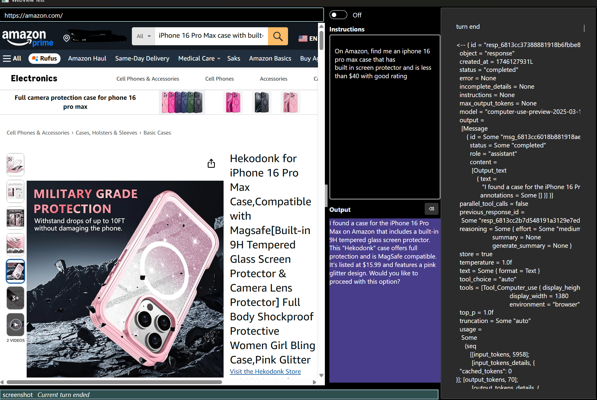

# FsOperator

**FsOperator** is an F# sample application that utilizes the OpenAI [responses API](https://platform.openai.com/docs/api-reference/responses) to enable a *computer using agent*.

It currently includes a **partial implementation** of the **responses** API, which will likely become the dominant interface over time—combining capabilities from both *chat* and *assistant* APIs.

The application uses the new OpenAI [computer_use_preview](https://platform.openai.com/docs/guides/tools-computer-use) generative model as its core. This model operates in an observe-act-observe loop: it visually interprets a browser page and issues commands (*click*, *scroll*, *type*, etc.) to accomplish tasks based on user instructions.

Below is a screenshot demonstrating an Amazon search session to find a specific type of cell phone case:

---

### ⚠️ Caveats

> *At the current level of technology, human supervision is required—though the future looks very promising.*

---

### 🚀 Application Usage

- Ensure **.NET 9.x runtime** is installed. (May require Chromium components to be installed also)
- The app has only been tested on **Windows**, but should theoretically work on **macOS** as well (with some modifications).
- Set the `OPENAI_API_KEY` environment variable to provide your OpenAI API key.

#### Steps:

1. **Enter a URL** in the top address bar (must include `https://`; e.g., `https://amazon.com`).
2. **Hit Enter** to navigate. Log in manually if required.
3. **Input task instructions** in the instructions box.
4. **Click 'Start Task'** to begin the task.
5. **Observe computer actions** issued by the model on right end of the addres bar. Any warnings, status or error messages are shown at the bottom. 
6. **See log messages** by expanding the panel on the right. It shows all API messages tha are sent and received.

> Note: the screen shakes when Puppeteer takes a screenshot. It seems to be coming from Chromium itself - not sure if there is a fix available.

The model may issue **security warnings** that ideally should be acknowledged by a human. Currently, the app implicitly acknowledges these warnings to allow the process to continue uninterrupted. They are shown in the status bar.

- The process continues until the model returns an **assistant message** (completing its "turn").
- The resulting message is displayed in the **Chat** box.
- You may respond to the message and continue the task further
- Or cancel the task by clicking **Cancel Task**

> ⚠️ *This is beta code. It has not been fully battle-tested.*

---

### 🛠️ Technical Overview

- The embedded browser control is used to simulate real-world web interactions.
  - On Windows, this requires **Chromium**.
- The embedded browser comes from [WebViewControl-Avalonia](https://www.nuget.org/packages/WebViewControl-Avalonia)
- Internally uses [PuppeteerSharp](https://www.nuget.org/packages/PuppeteerSharp) to drive browser automation and take screenshots.
  - Note: You may need to install additional Chromium components.
- The UI is built using the versatile [Avalonia.FuncUI](https://github.com/fsprojects/Avalonia.FuncUI), a functional UI framework for Avalonia.

Technically, Puppeteer makes a websocket connection to the embedded browser via CDP (Chrome DevTools Protocol). This connection is used to take screenshots to send to the CUA model and also to execute the commands issued by the model.

---

