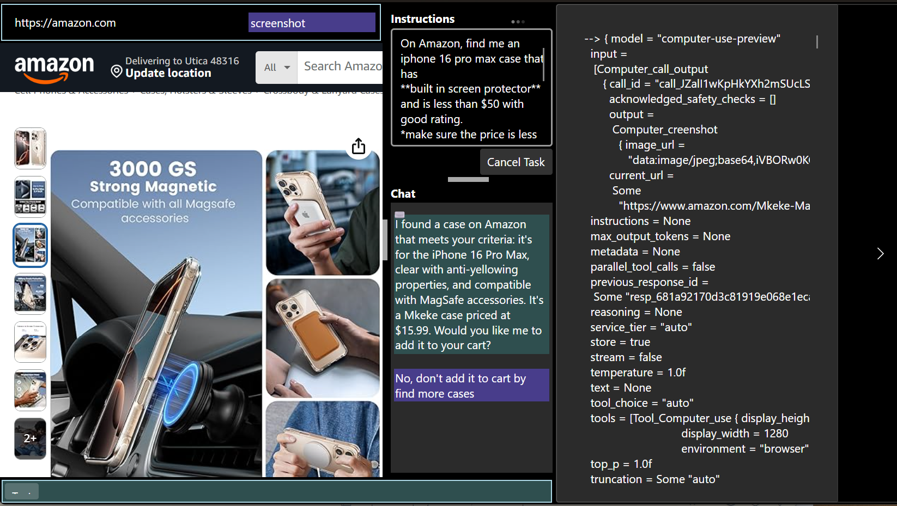

# FsOperator

**FsOperator** is an F# sample application that utilizes the OpenAI [responses API](https://platform.openai.com/docs/api-reference/responses) to enable a *computer using agent*.

It currently includes a **partial implementation** of the **responses** API, which is expected to become the dominant interface over time—combining capabilities from both *chat* and *assistant* APIs.

The application uses the new OpenAI [computer_use_preview](https://platform.openai.com/docs/guides/tools-computer-use) generative model as its core. This model operates in an observe-act-observe loop: it visually interprets a browser page and issues commands (*click*, *scroll*, *type*, etc.) to accomplish tasks based on user instructions.

Below is a screenshot demonstrating an Amazon search session to find a specific type of cell phone case:

---

### ⚠️ Caveats

> *At the current level of technology, human supervision is required—though the future looks very promising.*

---

### 🚀 Application Usage

- Ensure **.NET 9.x runtime** and **WebView2** host web control are installed. (WebView2 is usually installed by default on Windows.)
- The app has only been tested on **Windows**, but should theoretically work on **macOS** as well (with some modifications).
- Set the `OPENAI_API_KEY` environment variable to provide your OpenAI API key.

#### Steps:

1. **Enter a URL** in the top address bar (must include `https://`; e.g., `https://amazon.com`).
2. **Hit Enter** to navigate. Log in manually if required.
3. **Input task instructions** in the instructions box.
4. **Toggle the switch to "On"** to begin the task.
5. **Observe computer actions** issued by the model on right end of the addres bar. Any warnings, status or error messages are shown at the bottom. A dynamic script is injected into the browser page to preview actions before they are executed. Currently, mouse clicks and scroll requests are rendered on the screen.
6. **See log messages** by expanding the panel on the right. It shows all API messages tha are sent and received.

> Note: the screen shakes when Playwright takes a screenshot (not sure if there is fix available)

The model may issue **security warnings** that ideally should be acknowledged by a human. Currently, the app implicitly acknowledges these warnings to allow the process to continue uninterrupted. They are shown in the status bar.

- The process continues until the model returns a **message** (completing its "turn").
- The resulting message is displayed in the **Output** box.
- You can **manually stop** the process by switching the toggle to "Off".
- **Turn-by-turn conversations** are *not yet implemented*.

> ⚠️ *This is beta code. It has not been fully battle-tested.*

---

### 🛠️ Technical Overview

- The embedded browser control is used to simulate real-world web interactions.
  - On Windows, this requires **WebView2**.
- Internally uses [Microsoft.Playwright](https://www.nuget.org/packages/Microsoft.Playwright) to drive browser automation and take screenshots.
  - Note: You may need to install additional Chromium components.
- The UI is built using the versatile [Avalonia.FuncUI](https://github.com/fsprojects/Avalonia.FuncUI), a functional UI framework for Avalonia.

---

